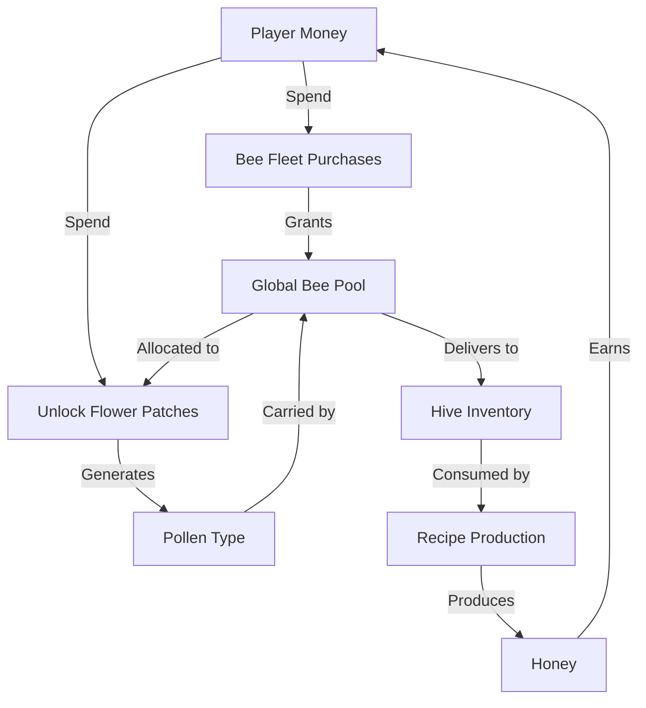

# Hive Empire - Economy & Progression Diagram

This document provides a structured view of all game economy parameters, their relationships, and how they interconnect to create the core gameplay loop.

## Core Resource Flow

```
[Player Money]
    ↓ (spend)
[Unlock Flower Patch]
    ↓
[Flower Patch Placed at Distance D]
    ↓ (generates)
[Pollen Type X]
    ↓ (carried by)
[Bee Fleet (global pool)]
    ↓ (delivers to)
[Hive Inventory]
    ↓ (consumed by)
[Recipe Production]
    ↓ (produces)
[Honey → Money]
    ↑ (loops back to top)
```

---

## 1. Flower Patch Economics

### 1.1 Initial Placement
| Parameter | Description | Impact |
|-----------|-------------|---------|
| **Placement Cost** | One-time cost to unlock and place patch | Gates access to biome-specific pollen |
| **Distance to Hive** | Physical distance in world units | Affects bee round-trip time (longer = slower income) |
| **Biome Type** | Defines pollen type produced | Determines which recipes can be produced |
| **Base Capacity** | Starting number of bee slots (default: 5) | Limits simultaneous deliveries from this patch |
| **Gathering Duration** | Time bees spend hovering at patch (default: 2.5s) | Adds fixed delay to each delivery cycle |

**Data Source:** `FlowerPatchData` ScriptableObject (`Assets/Resources/FlowerPatchData/*.asset`)

**Relationships:**
- Distance × Bee Speed = Round-trip time → Pollen delivery rate
- Placement Cost gates progression (must earn money to unlock new patches)
- Does NOT grant bees - bees must be purchased separately via Bee Fleet Upgrades
- Gathering Duration adds fixed overhead to each bee's delivery cycle

---

### 1.2 Capacity Upgrades (Tiered System)
| Parameter | Description | Impact |
|-----------|-------------|---------|
| **Capacity Upgrade Costs** | Money required for each tier (up to 5 tiers) | Progressive investment requirement |
| **Bonus Capacity Per Upgrade** | Additional bee slots added per tier | Allows more bees to work simultaneously |
| **Max Capacity Tier** | Maximum number of capacity upgrades available | Caps maximum bee allocation per patch |

**Data Source:**
- `FlowerPatchData.capacityUpgradeCosts[]` (array of costs per tier)
- `FlowerPatchData.bonusCapacityPerUpgrade` (default: +5 slots per tier)
- `FlowerPatchData.maxCapacityTier` (default: 5 tiers)

**Example Progression:**
```
Base Capacity: 5 bees
Tier 1 Upgrade: +5 bees (Total: 10) - Cost: $50
Tier 2 Upgrade: +5 bees (Total: 15) - Cost: $150
Tier 3 Upgrade: +5 bees (Total: 20) - Cost: $400
Tier 4 Upgrade: +5 bees (Total: 25) - Cost: $900
Tier 5 Upgrade: +5 bees (Total: 30) - Cost: $2000
```

**Relationships:**
- More capacity = more bees can work at this patch = more pollen throughput
- Constrained by global bee fleet (can't allocate more bees than you own)
- Investment choice: Upgrade one patch deeply vs spread upgrades across many patches
- Does NOT grant new bees - only increases allocation capacity per patch

---

## 2. Bee Fleet Economics

### 2.1 Global Fleet System
| Parameter | Description | Impact |
|-----------|-------------|---------|
| **Total Bees Owned** | Sum of all bees purchased via Bee Fleet Upgrades | Hard cap on total bee allocation |
| **Allocated Bees** | Bees assigned to specific flower patches | Active workforce generating income |
| **Unallocated Bees** | Bees available for assignment | Strategic reserve for optimization |
| **Per-Patch Capacity Limit** | Max bees that can work at one patch | Forces strategic distribution decisions |

**Data Source:** `BeeFleetManager` (runtime tracking)

**Relationships:**
- Total Bees Owned = Σ(Bee Fleet Purchase Tiers) - bees are ONLY acquired through purchases
- Allocated ≤ Total Bees Owned (hard constraint)
- Per-patch allocation ≤ Patch Capacity (hard constraint)
- Flower patches do NOT grant bees on unlock

---

### 2.2 Bee Fleet Purchases (Tiered System)
| Parameter | Description | Impact |
|-----------|-------------|---------|
| **Starting Bees** | Bees granted at game start (default: 2) | Initial workforce before any purchases |
| **Bee Purchase Costs** | Money required for each purchase tier (10 tiers total) | Progressive investment requirement |
| **Bees Per Purchase** | Number of bees added to global fleet per tier | Expands workforce capacity |
| **Max Purchase Tier** | Maximum number of bee purchase tiers available | Caps total bee fleet size |

**Data Source:** `BeeFleetUpgradeData` ScriptableObject (`Assets/Resources/BeeFleetUpgrades/*.asset`)

**Starting Bees:** `BeeFleetManager.startingBees = 2` (configurable via serialized field)

**Purchase Tier Progression:**
```
Starting: 2 bees (granted automatically at game start)

Tier 0: +2 bees  - Cost: $25   (Total: 4 bees)
Tier 1: +3 bees  - Cost: $60   (Total: 7 bees)
Tier 2: +5 bees  - Cost: $150  (Total: 12 bees)
Tier 3: +8 bees  - Cost: $350  (Total: 20 bees)
Tier 4: +12 bees - Cost: $800  (Total: 32 bees)
Tier 5: +18 bees - Cost: $1800 (Total: 50 bees)
Tier 6: +25 bees - Cost: $4000 (Total: 75 bees)
Tier 7: +35 bees - Cost: $8500 (Total: 110 bees)
Tier 8: +50 bees - Cost: $18000 (Total: 160 bees)
Tier 9: +70 bees - Cost: $38000 (Total: 230 bees)

Total Maximum Bees: 230 bees (2 starting + 228 purchased)
```

**Relationships:**
- Bees are the PRIMARY bottleneck in the game economy
- 2 starting bees allow immediate gameplay without blocking
- Must purchase bees before they can be allocated to patches
- Synergizes with capacity upgrades (need both bees AND capacity)
- Investment choice: Buy more bees vs upgrade patch capacity vs unlock new patches

---

### 2.3 Bee Delivery Mechanics
| Parameter | Description | Impact |
|-----------|-------------|---------|
| **Base Bee Speed** | Default movement speed (units/second) | Baseline for all delivery calculations |
| **Pollen Per Trip** | Amount of pollen carried per delivery | Fixed at 1 pollen per bee per trip |
| **Round-Trip Time** | (Distance × 2) / (Base Speed × Speed Modifier) | Core bottleneck for income rate |

**Data Source:** `BeeController.speed` (serialized field)

**Formula:**
```
Pollen/Second = (Allocated Bees × Pollen Per Trip) / Round-Trip Time
Round-Trip Time = (2 × Distance) / (Base Speed × Speed Modifier)
```

**Relationships:**
- Distance is enemy of throughput (exponential impact if many bees travel far)
- Speed upgrades are multiplicative force multiplier
- More bees allocated = linear throughput increase

---

## 3. Recipe Economics

### 3.1 Recipe Production
| Parameter | Description | Impact |
|-----------|-------------|---------|
| **Ingredients Required** | Pollen types + quantities needed | Defines prerequisite flower patches |
| **Production Time** | Seconds to complete recipe | Determines income rate (Money/Time) |
| **Honey Value** | Money earned per recipe completion | Direct income output |
| **Recipe Priority** | Position in recipe list | Determines production order when multiple recipes can run |

**Data Source:** `HoneyRecipe` ScriptableObject (`Assets/Resources/Recipes/*.asset`)

**Relationships:**
- Ingredients gate recipe availability (must have pollen types)
- Production Time × Honey Value = Income Rate ($/second)
- Priority determines which recipes consume shared pollen resources

---

### 3.2 Recipe Unlock Costs
| Parameter | Description | Impact |
|-----------|-------------|---------|
| **Unlock Cost** | Money required to activate recipe | Gates access to new income streams |
| **Is Unlocked By Default** | Boolean flag for auto-unlock at game start | Some recipes require unlocking, others start available |
| **Prerequisite Recipes** | Other recipes that must be unlocked first | Creates unlock progression chains |

**Data Source:** `HoneyRecipe` ScriptableObject (`Assets/Resources/Recipes/*.asset`)
- `HoneyRecipe.unlockCost` (float, minimum 0)
- `HoneyRecipe.isUnlockedByDefault` (boolean)
- `HoneyRecipe.prerequisiteRecipes[]` (array of required recipes)

**Managed By:** `RecipeProgressionManager.cs`
- `TryUnlockRecipe()` - Handles unlock logic, cost deduction, prerequisite validation
- `CanUnlockRecipe()` - Checks affordability and prerequisites
- Fires `OnRecipeUnlocked` event when unlocked

**UI Integration:** Full locked state UI in `RecipeEntryUI.cs`
- Gray overlay with lock icon for locked recipes
- Unlock button with cost display
- Prerequisites list display
- Updates when unlocked

**Relationships:**
- More complex recipes = higher unlock cost = higher honey value
- Prerequisite chains force strategic unlock order
- Unlocking recipes enables exponential growth through synergies

---

### 3.3 Recipe Upgrades
| Parameter | Description | Impact |
|-----------|-------------|---------|
| **Upgrade Costs** | Money per recipe upgrade tier (5 tiers) | Scaling investment per recipe |
| **Ingredient Reduction** | % decrease in pollen required | Saves pollen resources per production |
| **Production Time Reduction** | % decrease in production time | Increases income rate (more completions/minute) |
| **Honey Value Increase** | % increase in money output | Increases income per completion |

**Data Source:** `HoneyRecipe` ScriptableObject (`Assets/Resources/Recipes/*.asset`)

**Tier Progression (0-5):**
| Tier | Upgrade Cost | Ingredient Reduction | Production Time Reduction | Value Increase |
|------|--------------|---------------------|--------------------------|----------------|
| 0 (Base) | - | 0% | 0% | 0% |
| 1 | $100 | 10% | 15% | 20% |
| 2 | $300 | 20% | 25% | 40% |
| 3 | $800 | 30% | 35% | 60% |
| 4 | $2000 | 40% | 50% | 100% |
| 5 | $5000 | 50% | 60% | 150% |

**Example Progression:**
```
Base Recipe: 10 pollen → $100 (20 seconds)
Tier 1: 9 pollen (-10%) → $120 (+20%) (17 seconds, -15%)
Tier 5: 5 pollen (-50%) → $250 (+150%) (8 seconds, -60%)
```

**Managed By:** `RecipeProgressionManager.cs`
- `TryUpgradeRecipe()` - Handles upgrade logic, cost deduction, tier increment
- `CanUpgradeRecipe()` - Validates upgrade affordability and max tier
- Tracks current tier per recipe (0-5)
- Fires `OnRecipeUpgraded` event with new tier

**Applied By:** `RecipeProductionManager.cs`
- Uses `GetIngredients(tier)`, `GetProductionTime(tier)`, `GetHoneyValue(tier)`
- Applies tier modifiers during production cycle
- Stores tier when production starts for consistency

**UI Integration:** `RecipeEntryUI.cs`
- Tier badge display ("Tier X/3" - note: backend supports 0-5, UI text shows max 3)
- Upgrade button with cost display
- Upgrade tooltip with before/after preview
- Updates ingredient quantities based on tier

**Formula:**
```
Actual Ingredients = Base Ingredients × (1 - Ingredient Reduction%)
Actual Production Time = Base Time × (1 - Time Reduction%)
Actual Honey Value = Base Value × (1 + Value Increase%)

Income Rate = Actual Honey Value / Actual Production Time
```

**Relationships:**
- Time reduction = more completions per minute = exponential scaling
- Value increase = direct multiplier to income
- Ingredient reduction = less pollen consumption = smoother production
- Upgrading high-priority recipes has cascading effects on total income
- Synergizes with high bee allocation (more pollen → more recipe completions)

---

## 4. Economic Relationships & Formulas

**Note:** Hive has unlimited storage capacity - no inventory bottleneck exists. Bees can deliver pollen without capacity restrictions.

---

### 4.1 Pollen Generation Rate (Per Patch)
```
Pollen/Second = Allocated Bees / ((2 × Distance) / (Base Speed × Speed Modifier))
```

**Variables:**
- Allocated Bees: Number of bees working at this patch
- Distance: World distance from patch to hive
- Base Speed: BeeController.speed (default: ~5 units/second)
- Speed Modifier: From bee fleet upgrades (default: 1.0)

---

### 4.2 Recipe Income Rate
```
Income Rate ($/second) = Honey Value / Production Time

Conditions:
- Hive inventory must have all required ingredients
- Recipe must be highest priority available recipe
```

**Variables:**
- Honey Value: Money earned per completion (from HoneyRecipe.honeyValue)
- Production Time: Seconds per completion (from HoneyRecipe.productionTime)

---

### 4.3 Total Income Rate (Theoretical Maximum)
```
Total Income/Second = Σ (Active Recipes' Income Rates)

Bottleneck Check:
- If Pollen Generation < Recipe Consumption → Recipe income rate limited
- If Recipe Production Time too slow → Pollen stockpiles indefinitely (unlimited storage)
```

---

### 4.4 Distance Penalty Analysis
```
Round-Trip Time = (2 × Distance) / Speed
Income Impact = Distance is INVERSELY proportional to income

Example:
- Patch at 10 units, 5 units/sec speed → 4 seconds round-trip
- Patch at 20 units, 5 units/sec speed → 8 seconds round-trip
- 2× distance = 2× slower income (assuming same bee allocation)

Mitigation:
- Bee speed upgrades (multiplicative benefit)
- Higher bee allocation (linear benefit)
- Capacity upgrades (more parallel deliveries)
```

---

## 5. Strategic Investment Chains

### 5.1 Early Game Optimization
```
Starting Money ($50) → Purchase First Bees ($25 for 2 bees) → Unlock Flower Patch → Allocate Bees → Pollen Generation → Recipe Production → Income Loop Begins
```

**Key Decisions:**
- Purchase bees FIRST or unlock flower patch first? (need both to generate pollen)
- Which biome to unlock first? (distance vs recipe synergy)
- How many bees to purchase vs saving for second patch?
- Allocate all bees to one patch or spread across patches?

---

### 5.2 Mid Game Scaling
```
Income → Buy More Bees → Unlock Multiple Patches → Upgrade Patch Capacities → Unlock Recipes → Upgrade Recipes → Recipe Synergies → Exponential Growth
```

**Key Decisions:**
- Balance bee purchases vs patch unlocks vs capacity upgrades vs recipe unlocks/upgrades
- Prioritize high-value recipes via ingredient availability
- Optimize bee allocation per patch vs distance
- Deep investment in one patch capacity vs wide investment across many patches
- Which recipes to unlock and upgrade first?

---

### 5.3 Late Game Optimization
```
All Patches Unlocked → Fleet Maximized → Capacity Maximized → All Recipes Unlocked → Recipe Tiers Maximized → Recipe Priority Tuning → High Score Push
```

**Key Decisions:**
- Fine-tune bee allocation for maximum throughput
- Maximize high-value recipe completions (prioritize upgraded recipes)
- Balance pollen generation vs consumption rates
- Final recipe upgrade investments for maximum income rate

---

## 6. Missing Parameters & Expansion Ideas

### 6.1 Currently Not Implemented
| Feature | Description | Potential Impact |
|---------|-------------|------------------|
| **Hive Storage Capacity System** | Implement inventory limits with upgrades | Would create storage bottleneck decisions and new upgrade path |
| **Distance Scaling Formula** | Procedural/algorithmic distance calculation | Currently manual placement in Unity scene |
| **Bee Speed Upgrades** | Global fleet speed multipliers | Would reduce distance penalty across all patches |

**Note:** The following features were previously listed as "not implemented" but are FULLY FUNCTIONAL:
- ✅ **Recipe Unlock Costs** - Fully implemented (see Section 3.2)
- ✅ **Recipe Upgrades** - Fully implemented with 5-tier system (see Section 3.3)
- ✅ **Bee Fleet Starting Size** - Implemented as 2 starting bees (see Section 2.2)

---

### 6.2 Hidden Economic Levers
| Parameter | Current Value | Location | Impact |
|-----------|---------------|----------|--------|
| **Starting Money** | $50 | GameManager | Determines first purchase options |
| **Starting Bees** | 2 | BeeFleetManager.startingBees | Initial workforce before any purchases |
| **Week Duration** | 60 seconds | SeasonManager | Affects campaign length feel |
| **Pollen Per Trip** | 1 | BeeController (implicit) | Baseline throughput |
| **Gathering Duration** | 2.5 seconds | FlowerPatchData.gatheringDuration | Fixed delay per bee delivery cycle |
| **Recipe List Priority** | Manual list order | RecipeProductionManager scene reference | Determines production order |
| **Hive Storage Capacity** | Unlimited | HiveController (no capacity checks) | No storage bottleneck exists |

---

## 7. Visualization Suggestions

### 7.1 Recommended Diagram Types

**Flow Diagram (Mermaid):**


**Investment Tree (Hierarchical):**
```
Money
├── Bee Fleet Purchases (10 tiers)
│   └── +2/3/5/8/12/18/25/35/50/70 Bees
├── Flower Patch Unlocks
│   └── Capacity Upgrades (5 tiers per patch)
│       └── +5 Bee Slots per tier
└── Recipe Unlocks
    └── Recipe Upgrades (5 tiers per recipe)
        ├── Ingredient Reduction (0-50%)
        ├── Production Time Reduction (0-60%)
        └── Value Increase (0-150%)
```

**Spreadsheet (Tuning Reference):**
| Biome | Placement Cost | Distance | Base Capacity | Cap T1 | Cap T2 | Cap T3 | Cap T4 | Cap T5 | Max Capacity |
|-------|----------------|----------|---------------|--------|--------|--------|--------|--------|--------------|
| Forest Edge | $XX | XX u | 5 bees | $50 | $150 | $400 | $900 | $2000 | 30 bees |
| Wildflower | $XX | XX u | 5 bees | $50 | $150 | $400 | $900 | $2000 | 30 bees |
| *(values from FlowerPatchData/*.asset)* |

---

## 8. Key Balancing Considerations

### 8.1 Critical Ratios
```
Pollen Generation Rate vs Recipe Consumption Rate
- Too much generation = pollen stockpiles indefinitely (unlimited storage)
- Too little generation = idle recipes (lost income)
- No storage bottleneck exists - balance is purely throughput-based

Distance Penalty vs Bee Allocation
- Far patches need more bee allocation to compensate for travel time
- Distance penalty is LINEAR (2× distance = 2× slower throughput per bee)
- Closer patches are more efficient per-bee investments

Bee Purchases vs Capacity Upgrades vs Patch Unlocks vs Recipe Progression
- Bees are required for ANY pollen generation (PRIMARY bottleneck)
- Capacity upgrades only useful if you have bees to allocate
- New patches enable recipe synergies (multi-pollen recipes)
- Recipe unlocks/upgrades provide exponential income scaling
- Optimal balance: Buy bees → Unlock patches → Unlock recipes → Upgrade capacities + Upgrade recipes
```

---

### 8.2 Economic Pressure Points
```
Early Game: Limited bees, limited patches, locked recipes → Slow income loop startup
Mid Game: Bee allocation decisions + Recipe unlock choices → Strategic depth emerges
Late Game: Fine-tuning allocation + Recipe upgrade optimization → Complex optimization puzzle

Bottleneck Hierarchy:
1. Global Bee Fleet (hard cap on throughput) - PRIMARY BOTTLENECK
2. Flower Patch Capacity (limits bees per patch) - SECONDARY BOTTLENECK
3. Flower Patch Distance (affects delivery time) - EFFICIENCY PENALTY
4. Recipe Production Time (affects income conversion) - INCOME RATE LIMITER
5. Recipe Unlock/Upgrade State (multiplicative income scaling) - PROGRESSION GATING

Note: No storage capacity bottleneck exists (unlimited inventory)
```

---

## 9. Example: Flower Patch Economic Profile Template

```
🌲 [Biome Name] (BiomeType: XXX, Pollen: XXX)

Placement:
- Unlock Cost: $XX (one-time payment)
- Distance to Hive: XX units
- Base Capacity: 5 bee slots
- Gathering Duration: 2.5 seconds

Capacity Upgrades (5 tiers available):
- Tier 1: $50  → Total capacity: 10 bees (+5)
- Tier 2: $150 → Total capacity: 15 bees (+5)
- Tier 3: $400 → Total capacity: 20 bees (+5)
- Tier 4: $900 → Total capacity: 25 bees (+5)
- Tier 5: $2000 → Total capacity: 30 bees (+5)

Pollen Output Calculation (assuming base speed 5 u/s):
- 5 bees allocated (base capacity, no upgrades):
  - Round-trip time: ((2 × XX units) / 5 u/s) + 2.5s gathering = XX seconds
  - Pollen/second: 5 bees / XX seconds = X.X pollen/s

- 10 bees allocated (Tier 1 capacity upgrade):
  - Pollen/second: 10 bees / XX seconds = X.X pollen/s

- 30 bees allocated (Tier 5 capacity upgrade):
  - Pollen/second: 30 bees / XX seconds = X.X pollen/s

Recipe Synergy:
- [Simple Recipe]: Unlock Cost $XX, Base: X [Pollen Type] → $XX (XX sec)
  - Tier 5 Upgraded: X [Pollen] (-50%) → $XXX (+150%) (XX sec, -60%)
- [Complex Recipe]: Unlock Cost $XX, Prerequisites: [Recipe A, Recipe B]
  - Base: X [Pollen A] + X [Pollen B] → $XXX (XX sec)
  - Tier 5 Upgraded: X [A] + X [B] (-50%) → $XXX (+150%) (XX sec, -60%)

Economic Analysis:
- Proximity bonus: [Near/Medium/Far] distance = [High/Medium/Low] efficiency
- Synergy value: Required for [X] recipes
- Investment priority: [Early/Mid/Late] game unlock recommendation
```

---

## Notes
- All costs and values subject to balancing iterations
- Seasonal modifiers intentionally excluded per user request
- This diagram serves as **design reference** and **balancing tool**
- Use alongside `Assets/Readme.md` for complete design context

---

**Last Updated:** 2025-01-24 (Corrected to reflect actual implementation status)
**Document Purpose:** Economic visualization and balancing reference
**Target Audience:** Game designers, economy tuners, Claude Code AI assistant
